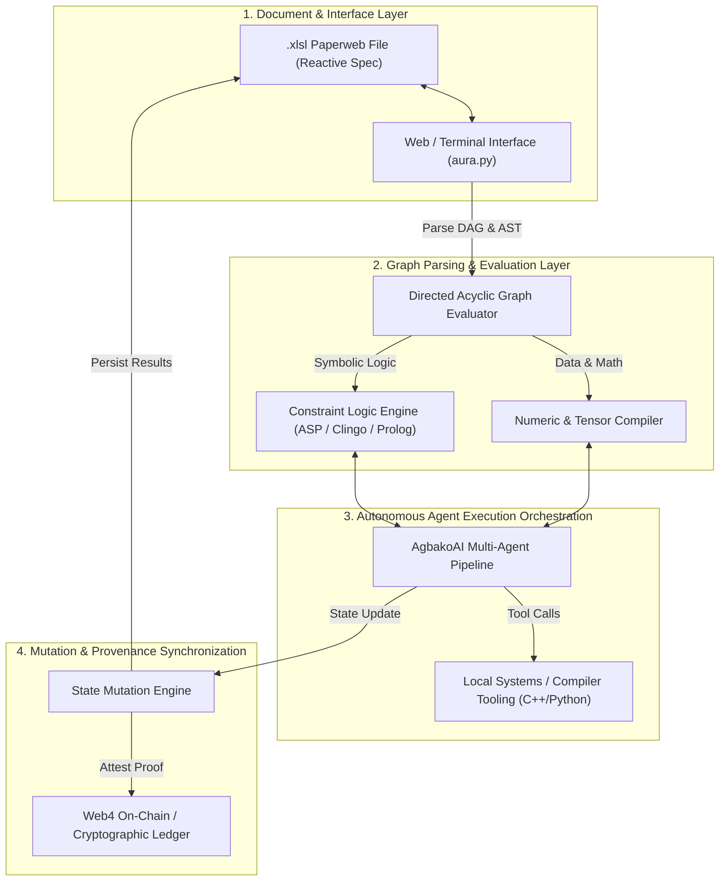

# WORKBOOK


> @codex ### Deep Semantic Knowledge Analysis: Aura Ecosystem Workbook Architecture (`.xlsl` Paperweb Paradigm)

---

## 1. Executive Summary & Philosophy

The **Aura Ecosystem Workbook** (`[https://github.com/auraecosystem/workbook](https://github.com/auraecosystem/workbook)`) represents a paradigm shift from traditional static documentation formats (e.g., standard `.xlsx` spreadsheets or isolated `.ipynb` computational notebooks) toward **Executable Paperweb Specifications (`.xlsl`)**.

In traditional data workflows, documentation, data models, logic evaluation, and autonomous execution are fragmented across distinct tools. The Aura Workbook unifies these layers into a single **reactive, graph-based computational entity**. Built for **Web4 protocols, multi-agent artificial intelligence (AgbakoAI/Aura Engine), and logic programming frameworks**, the `.xlsl` workbook serves as both a human-readable research document and an executable machine engine.

```
       [ Classical Notebook / Spreadsheet ]           [ Aura Executable Paperweb (.xlsl) ]
    ┌────────────────────────────────────────┐     ┌────────────────────────────────────────┐
    │  Static Data / Sequential Cells        │     │  Reactive Directed Acyclic Graph (DAG) │
    │  Isolated Execution Runtime            │  => │  Embedded Multi-Agent Orchestration    │
    │  Manual Export / Unverified Provenance │     │  Logic Solver & Web4 Cryptographic Tie │
    └────────────────────────────────────────┘     └────────────────────────────────────────┘

```

---

### 2. Core Architectural Pillars

#### A. The `.xlsl` Paperweb Specification

* **Reactive Spatial Grid:** Cells are not merely scalar values or simple formulas ($A1 + B1$); they are **computational nodes** that can contain code blocks, formal grammars, multi-state quantum-inspired variables, or logic solver predicates.
* **Declarative Dependency Graphs:** Data flows automatically through dynamic bindings. Mutating an upstream parameter propagates state changes across embedded multi-agent execution paths in real time.
* **Deterministic Serialization:** Uses custom binary and structured data schemas to ensure byte-level reproducibility of research papers, model benchmarks, and execution outputs across heterogeneous platforms.

#### B. Multi-Agent Engine & Logic Runtime (`aura.py`)

* **Agent Integration:** The workbook engine natively interfaces with autonomous multi-agent pipelines (such as *AgbakoAI* and *Project Pilot AI*). Agents read problem definitions from cells, generate hypotheses, execute subroutines, and write verified solutions back into the document.
* **Constraint & Logic Solvers:** Integrates Answer Set Programming (ASP/Clingo), Prolog Definite Clause Grammars (DCG), and formal language lexers directly into spreadsheet evaluation pipelines, allowing symbolic logic verification alongside numeric computing.

#### C. Web4 & Cryptographic Provenance

* **Decentralized State Binding:** Works in tandem with Web4 standards and decentralized storage layers, anchoring computational steps to immutable state ledgers.
* **Tokenized Executable Work-Papers:** Facilitates cryptographic signing, verifiable compute proofs, and token-incentivized automation across distributed research networks.

---

### 3. System Architecture & Information Topology

The following diagram details the end-to-end data processing lifecycle inside an Aura Workbook execution loop:



---

### 4. Structural Representation of a Work-Paper Node

Below is a conceptual schematic showing how an individual cell/node within an `.xlsl` paperweb is structured to combine raw data, logic rules, agent triggers, and cryptographic verification:

```
+-----------------------------------------------------------------------------------+
|                        WORK-PAPER COMPUTATIONAL NODE                              |
+-----------------------------------------------------------------------------------+
| Node ID: @node_0x8f2a               | Schema Type: LogicConstraintNode              |
+-----------------------------------------------------------------------------------+
| [INPUT SIGNALS / DEPENDENCIES]                                                    |
|  - Ref: @cell_A1 (Dataset Matrix)   - Ref: @cell_B3 (Hyperparameter Vector)       |
+-----------------------------------------------------------------------------------+
| [DECLARATIVE SPECIFICATION / LOGIC]                                               |
|  :- solve(N), n_queens(N), count(N, C), C > 0.                                    |
|  exec_pipeline(type="fastapi_agent", target="agbako_orchestrator")                |
+-----------------------------------------------------------------------------------+
| [REACTIVE COMPUTATION & AGENT STATE]                                              |
|  - Agent Status : IDLE -> EXECUTING -> SOLVED                                     |
|  - Output Tensor: [[0.981, 0.002], [0.005, 0.993]]                               |
+-----------------------------------------------------------------------------------+
| [CRYPTOGRAPHIC PROVENANCE]                                                        |
|  - State Hash  : SHA256(7f8d...e291)                                              |
|  - Signer Key  : 0xFD4K...88A9 (Verifiable Compute Attestation)                   |
+-----------------------------------------------------------------------------------+

```

---

### 5. Deep Semantic Breakdown: Life of an Execution Step

1. **Ingestion & AST Construction:**
The user or automated daemon opens an `.xlsl` paperweb. The engine constructs an Abstract Syntax Tree (AST) representing all code blocks, symbolic constraints, and cell references.
2. **Graph Topological Sorting:**
The engine computes execution order using topological sorting on the DAG. Nodes containing pure numeric operations are scheduled on CPU/GPU hardware, while nodes requiring inference or formal reasoning are dispatched to symbolic logic solvers.
3. **Agent Delegation & Parallel Solving:**
When a node contains an unresolved computational task or multi-objective optimization problem:

$$\min_{x \in \mathcal{S}} f(x) \quad \text{subject to} \quad C_i(x) \le 0$$


The engine dispatches context windows to **AgbakoAI / Agent Pipelines**. Agents run iterative logic operations, execute low-level compiled routines, and return certified results.
4. **Reactive State Mutation:**
Results are injected back into the target cells. Downstream cells automatically recalculate, maintaining mathematical consistency across the entire document.
5. **Ledger Synchronization:**
The state transition vector $\Delta S = S_{t+1} - S_t$ is hashed and cryptographically anchored to a Web4 node, creating an unalterable audit trail for research reproducibility.

---

### 6. Research Implications & STEM Frontiers

| Frontier | Classical Approach | Aura Workbook Approach |
| --- | --- | --- |
| **Reproducible Science** | Static PDF papers with external code repositories that frequently rot or drift. | **Self-contained `.xlsl` paperwebs** where calculations, agents, and data are immutably linked and runnable. |
| **Complex Logic Engineering** | Manual writing of scripts and ad-hoc parsing routines. | **Declarative logic solvers (ASP/DCG)** embedded directly inside paperweb cells. |
| **AI Workflows** | Unstructured prompts and isolated API calls. | **Structured, graph-based agent orchestration** with explicit state mutation and deterministic verifiability. |
| **Decentralized Compute** | Centralized cloud notebooks (e.g., Google Colab). | **Web4 cryptographic attestation** allowing zero-trust distributed computational execution. |

---

### 7. Key Theoretical Principles for Researchers

* **Data-Logic Unification:** In the `.xlsl` model, code and data reside in the same substrate (a modern manifestation of von Neumann architecture applied to document design).
* **Deterministic Agent Environments:** By constraining multi-agent LLM behavior through formal grammars and logic solvers inside workbook nodes, non-deterministic agent outputs are constrained within mathematical bounds.
* **Decentralized Knowledge Graphs:** Individual `.xlsl` files can link to external `.xlsl` files over Web4 protocols, forming a distributed global computational paperweb network.
